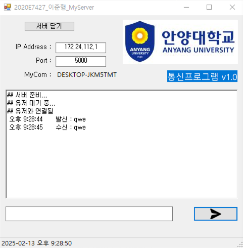
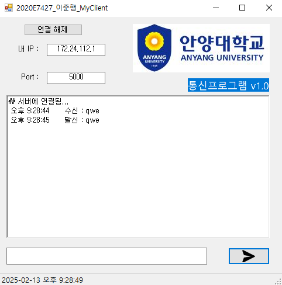

# 💬 C# TCP/IP Socket Chatting Program

WinForms와 .NET Socket 라이브러리를 활용하여 개발한 **1:1 실시간 채팅 프로그램**입니다.
소켓 프로그래밍의 기초인 3-Way Handshake 연결 과정과 스트림(Stream)을 이용한 데이터 송수신 과정을 이해하기 위해 제작되었습니다.

## 📸 실행 화면

| 서버(Server)  |클라이언트(Client)|
|:---:|:---:|
|  | |

> *서버와 클라이언트가 로컬 네트워크 상에서 메시지를 주고받는 모습입니다.*

## 🛠 개발 환경

* **Language**: C#
* **Framework**: .NET Framework 4.8 (Client) / 4.7.2 (Server)
* **IDE**: Visual Studio 2022
* **Type**: Windows Forms Application

## 💡 주요 기능

* **서버 (Server)**
    * 내 PC의 호스트 이름과 IP 주소 자동 감지 및 표시
    * 지정된 포트(5000)로 클라이언트 연결 대기 (`TcpListener`)
    * 클라이언트 접속 시 연결 상태 및 시간 로그 출력
    * 메시지 송수신

* **클라이언트 (Client)**
    * 서버 IP와 포트를 입력하여 연결 요청 (`TcpClient`)
    * 서버와 연결 수립 후 메시지 송수신
    * 연결 해제 기능

## 🧩 핵심 로직 (Code Review)

### 1. 별도 스레드를 통한 비동기 수신
`StreamReader.ReadLine()`  메인 스레드에서 메소드가 데이터가 들어올 때까지 대기(Block)하기 때문에 실행하면 프로그램이 멈춥니다. 이를 별도의 스레드를 생성하여 문제를 해결하였습니다. 

```csharp
// Server & Client 공통 로직
thread1 = new Thread(connect); // 통신 전용 스레드 생성
thread1.IsBackground = true;   // 백그라운드 스레드로 설정 (폼 종료 시 함께 종료)
thread1.Start();